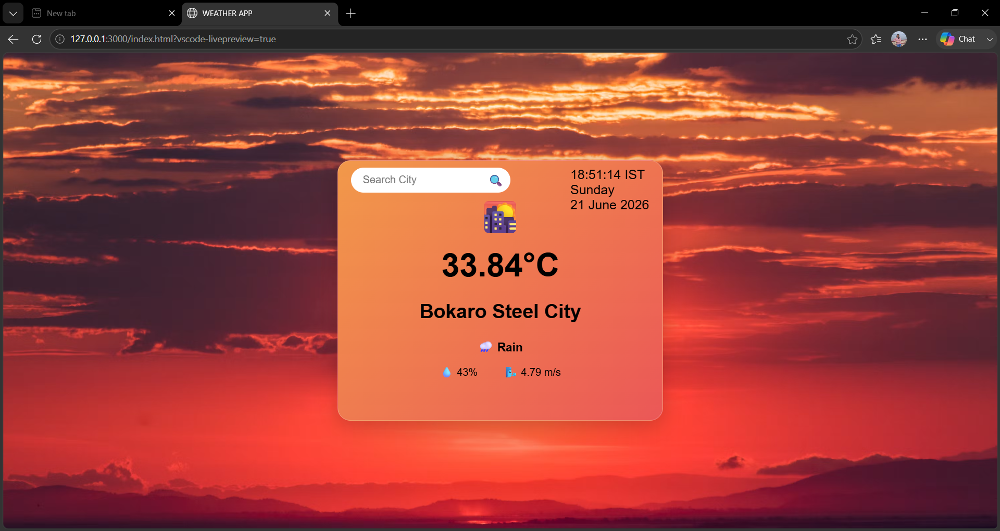
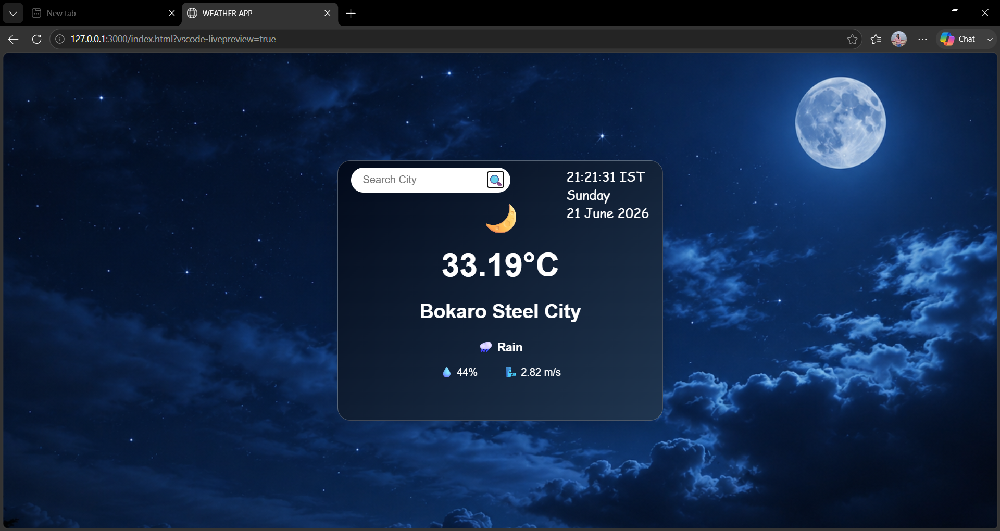
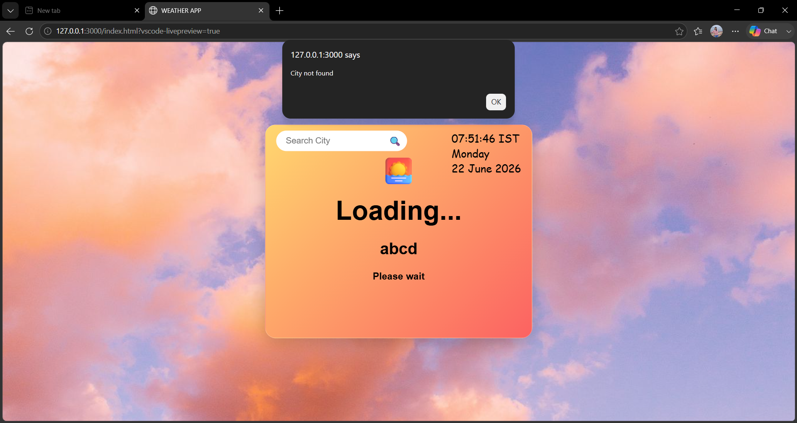

# Weather App 🌤️

A simple weather app built using HTML, CSS and JavaScript.

## Features
- Search weather by city
- Shows temperature
- Shows humidity
- Shows wind speed

## Tech Stack
- HTML
- CSS
- JavaScript
- OpenWeatherMap API

## Future Improvements 🚀

- Add 5-day weather forecast
- Add hourly forecast
- Detect user's current location
- Add dark/light mode
- Improve UI animations
- Add weather background effects (rain, snow, clouds)

## How to Run
1. Clone the repository
2. Add your API key
3. Open index.html

## Screenshots

### Evening Weather

### Night Weather

### Alert

